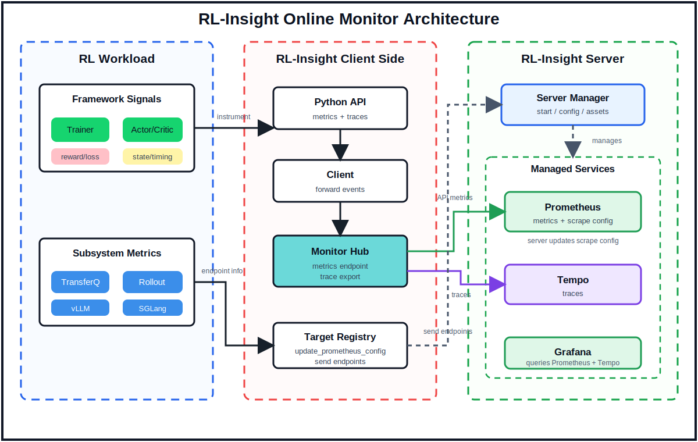

<p align="center">
  
</p>

<h1 align="center">RL-Insight</h1>

<p align="center">
  Online observability for reinforcement learning training. RL-Insight connects training-side metrics, RL state traces, and service dashboards across distributed rollout and optimization workloads.
</p>

<div align="center">

[](https://deepwiki.com/verl-project/rl-insight)
[](https://github.com/verl-project/rl-insight/stargazers)
[](https://twitter.com/verl_project)
[](https://rl-insight.readthedocs.io/en/latest/)

</div>

## Why RL-Insight

RL-Insight focuses on the online observability path that RL training needs most:

- **One-command server startup**: install dependencies and start the RL-Insight server with Prometheus, Tempo, and Grafana with `rl-insight server install` and `rl-insight server start`.
- **Trainer and rollout metric aggregation**: collect key actor, rollout, and transfer queue metrics in one monitoring view while keeping training-side instrumentation lightweight.
- **CPU and Ascend NPU monitoring**: register node_exporter and NPU Exporter endpoints to view hardware metrics in the RL-Insight Grafana dashboards.
- **Grafana dashboards for RL workloads**: provide ready-to-use dashboard structure for training metrics, rollout behavior, engine metrics, and RL state timelines.

## Architecture

<p align="center">
  
</p>

RL-Insight has two metric sources. Training code reports framework-internal signals through the Python API, and RL subsystems such as rollout engines and transfer queues register their own `/metrics` endpoints through the metric aggregation interface. The RL-Insight server coordinates the training side and manages Prometheus, Tempo, and Grafana so metrics, traces, and subsystem signals converge into unified RL dashboards.

## Demo

Two VeRL Trainer v1 + vLLM integration demos:

### Sync with vLLM

https://github.com/user-attachments/assets/b0f05f3e-8b21-4813-8ba6-4796aa844d62

<p align="center">
  <a href="https://github.com/user-attachments/assets/b0f05f3e-8b21-4813-8ba6-4796aa844d62">Watch the demo video</a>
</p>

### Separate Async with vLLM

https://github.com/user-attachments/assets/d0ef242d-e108-468f-afa5-ec9a5321f0e8

<p align="center">
  <a href="https://github.com/user-attachments/assets/d0ef242d-e108-468f-afa5-ec9a5321f0e8">Watch the demo video</a>
</p>

## News

- [2026/07/16] RL-Insight 0.2.0 is released and now integrated into verl. See the [verl integration guide](https://github.com/verl-project/verl/blob/main/docs/advance/rl_insight.md) to enable training, rollout, TransferQueue, trace, and hardware monitoring.
- [2026/06/16] RL-Insight officially supports Online Monitor, including one-command server startup, trainer and rollout metric aggregation, and Grafana dashboards for RL workloads.

## Get Started

Start with the guide that matches your current setup:

| Document | What it covers | When to use it |
|---|---|---|
| [Server Installation](./docs/monitor/server_installation.md) | Prometheus, Tempo, and Grafana service setup, including supported Linux platforms, direct installation, offline installation, and existing service binaries. | Use this first if the monitor services are not installed or you need to verify the server environment. |
| [Quick Start](./docs/monitor/quick_start.md) | A full smoke-test flow: install the Python package, start the monitor stack, emit sample metric/trace data, and open Grafana. | Use this after the services are ready, or when you want to validate the monitor path end to end. |
| [Hardware Monitoring](./docs/monitor/hardware/index.md) | Install or reuse node_exporter and NPU Exporter, then register CPU and Ascend NPU targets with RL-Insight. | Use this when you want hardware metrics in the RL-Insight Grafana dashboards. |

Recommended order:

1. Prepare the server services with [Server Installation](./docs/monitor/server_installation.md).
2. Run the end-to-end flow with [Quick Start](./docs/monitor/quick_start.md).

## Server Stack

RL-Insight manages three open-source services locally on Linux:

| Service | Purpose | Default port | Required version | Installer version |
|---|---|---:|---:|---:|
| Prometheus | Metric storage and queries | `9090` | `>= 2.30.0` | `2.54.1` |
| Tempo | Trace storage and query API | `3200` | `>= 2.0.0` | `2.6.1` |
| Grafana | Dashboards and trace exploration | `3000` | `>= 13.0.0` | `13.0.0` |

`rl-insight server install` downloads supported Linux binaries into `~/.rl-insight/services`. `rl-insight server start` runs the RL-Insight server with Prometheus, Tempo, and Grafana with data persisted under `~/.rl-insight/data` by default.

## Training API

`rl_insight/` exports the online monitor public API, so training code can import one module:

| API | Use |
|---|---|
| `init(project=None, experiment_name=None, config=None)` | Enable monitoring once per process and attach global labels. |
| `metric_count(name, amount=1.0, documentation="", **labels)` | Increment a Prometheus counter. |
| `metric_gauge(name, value, documentation="", **labels)` | Record the latest value for a gauge. |
| `metric_histogram(name, value, documentation="", **labels)` | Add one sample to a histogram. |
| `trace_state(state_name, state_lane_id=None, **labels)` | Record a named RL state interval. |
| `trace_op(name=None, extra_labels=None, **static_labels)` | Decorate a synchronous function and emit one duration span per call. |
| `finish()` | Reset in-process monitor state. |

Configuration can be passed to `insight.init(config=...)` or through environment variables:

```python
insight.init(
    project="verl",
    experiment_name="ppo-smoke-test",
    config={
        "server": {
            "namespace": "rl_insight_monitor",
            "backend": "ray",
            "url": "http://<server-ip>:18080",
        },
        "prometheus": {
            "metrics_report_port": 9092,
        },
    },
)
```

Useful environment variables:

| Variable | Purpose |
|---|---|
| `RL_INSIGHT_SERVER_URL` | RL-Insight server URL, for example `http://<server-ip>:18080`. |

## Recipe Offline Analysis

Offline timeline, heatmap, and parser utilities are kept under `recipe/`; see [Recipe README](./recipe/README.md) for that workflow.

## Roadmap

- Q1 Roadmap https://github.com/verl-project/rl-insight/issues/6
- Q2 Roadmap https://github.com/verl-project/rl-insight/issues/49

## Documentation

- [Quick Start](./docs/monitor/quick_start.md): install RL-Insight, start the services, instrument code, and open Grafana.
- [Server Installation](./docs/monitor/server_installation.md): Linux service requirements, supported OS/CPU combinations, and version policy.
- [Hardware Monitoring](./docs/monitor/hardware/index.md): install exporters and register CPU or Ascend NPU scrape targets.
- [Default server config](./rl_insight/config/config.yaml): bundled ports, retention settings, and service config paths.
- [Recipe README](./recipe/README.md): offline timeline, heatmap, and parser utilities.

## Contribution Guide

See [CONTRIBUTING.md](./CONTRIBUTING.md).
